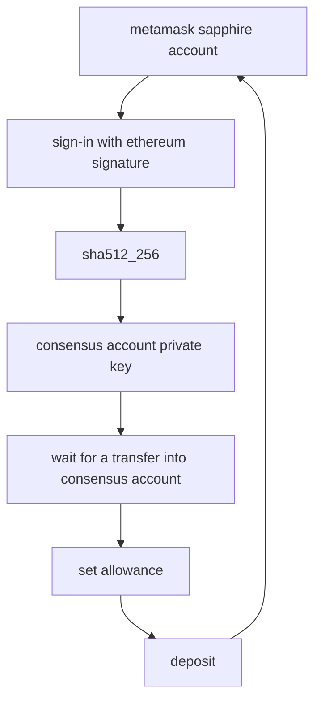
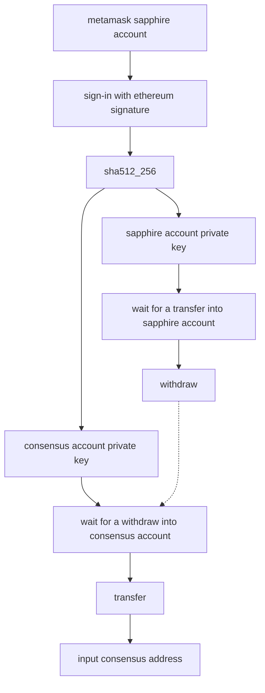

# ROSE Move

A dApp that enables you to easily transfer ROSE from your consensus account
(e.g. on a centralized exchange) to your account on Oasis Sapphire, or vice
versa.

## Architecture

- Deposit:



- TODO: Withdraw



## Getting started

### Installing and running from source code

```sh
yarn
yarn dev

# to see all steps without transferring ROSE, type this into browser console
mock = true
```
